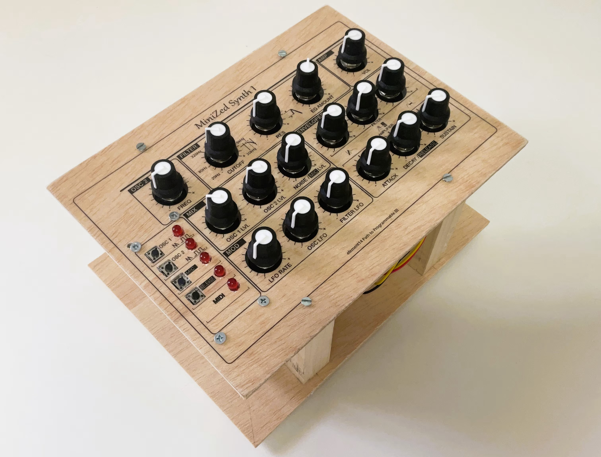

# element14 Path To Programmable III
element14 Path to Programmable III support repository

# Final Project

* Code: [Minized Synth I sources](./MinizedSynthI)

* Blog: [AMD Zynq SoC MIDI Vintage Sound Synthesizer](https://community.element14.com/challenges-projects/design-challenges/pathprogrammable3/b/blog/posts/amd-zynq-soc-midi-vintage-sound-synthesizer)

# Blog 1
[P2P3 Getting Started. Clockless Hardware Blinky on the Avnet Minized](https://community.element14.com/challenges-projects/design-challenges/pathprogrammable3/b/blog/posts/p2p3-getting-started-clockless-hardware-blinky-on-the-avnet-minized)

# Blog 2
[P2P3 AMD Vitis portability and reuse. Migrating a Microblaze bare metal environmental monitor App to the Zynq architecture.](https://community.element14.com/challenges-projects/design-challenges/pathprogrammable3/b/blog/posts/p2p3-amd-vitis-portability-and-reuse-migrating-microblaze-bare-metal-environmental-monitor-app-to-zynq)

# Blog 3
[P2P3 AMD Zynq-7000 SoC XADC. External Multiplexer Mode.](https://community.element14.com/challenges-projects/design-challenges/pathprogrammable3/b/blog/posts/p2p3-amd-zynq-7000-soc-xadc-external-multiplexer-mode)

# Blog 4
[P2P3 AMD Vivado Cascaded Integrator Comb (CIC) Compiler. PDM Microphone to PCM Decimation](https://community.element14.com/challenges-projects/design-challenges/pathprogrammable3/b/blog/posts/p2p3-amd-vivado-cascaded-integrator-comb-cic-compiler-pdm-microphone-to-pcm-decimation)

# Blog 5
[P2P3 Wireless sensors on the Avnet Minized. Getting Started with PetaLinux](https://community.element14.com/challenges-projects/design-challenges/pathprogrammable3/b/blog/posts/p2p3-wireless-sensors-on-the-avnet-minized-getting-started-with-petalinux)

